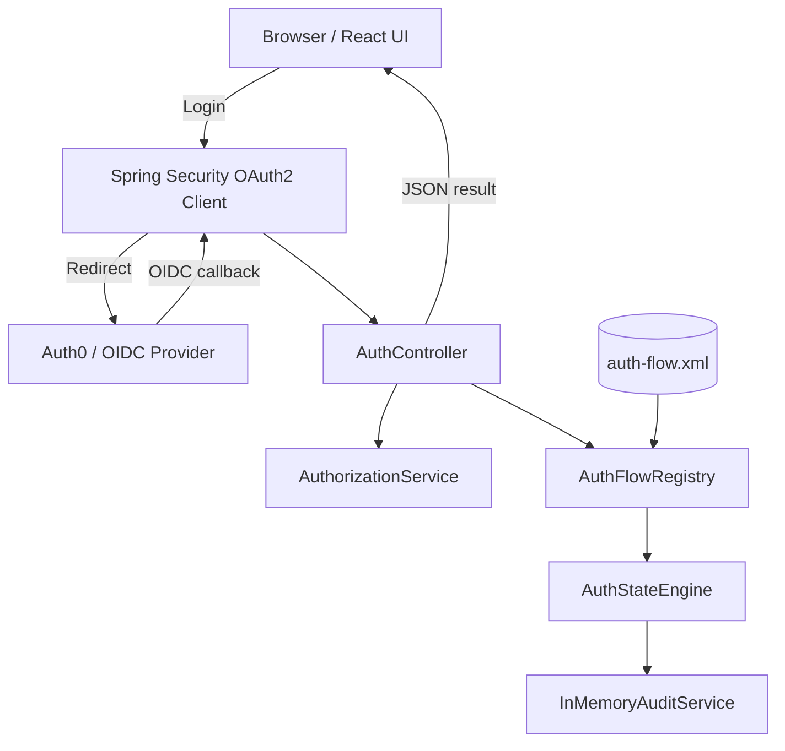
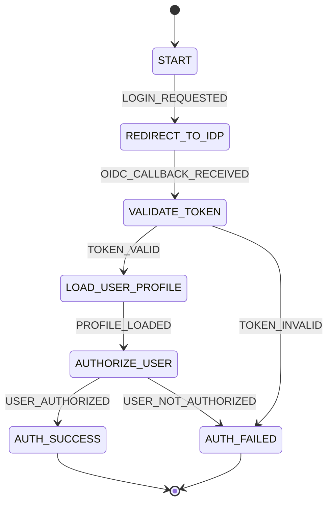
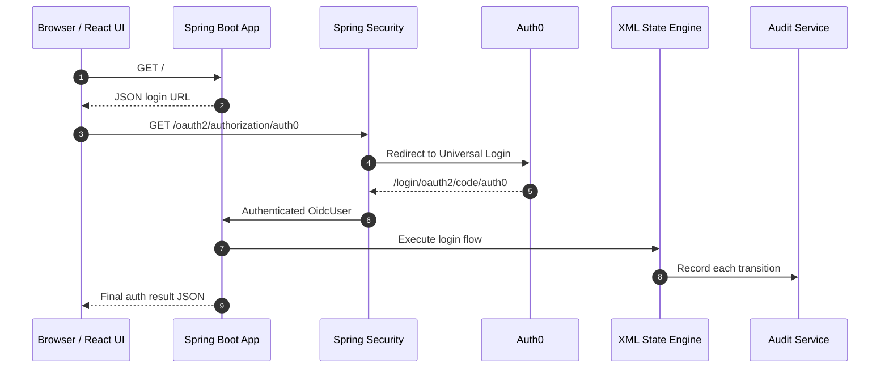
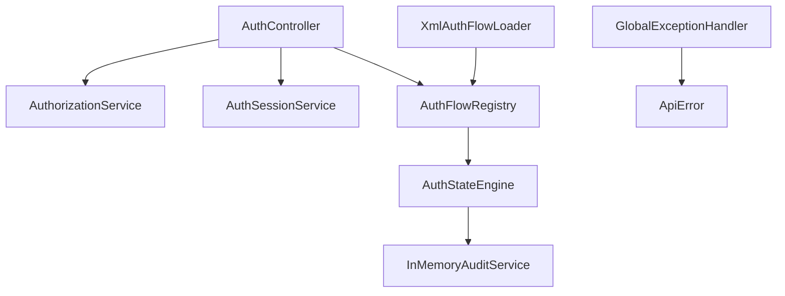

# Spring Boot OIDC Authentication State Engine

A portfolio-grade Spring Boot 3.5 / Java 21 authentication orchestration service that integrates Spring Security OAuth2 Client with Auth0/OIDC and an XML-defined authentication state engine.

The project separates identity authentication from application-owned post-login orchestration. Auth0 handles identity proofing; the Spring Boot service handles state transitions, profile inspection, authorization decisions, audit records, idempotency, and operational error handling.

## Features

- OAuth2/OIDC login with Auth0 through Spring Security
- XML-defined authentication state machine
- Pluggable flow registry for adding additional auth journeys
- OIDC profile extraction and email verification checks
- Group/role authorization with documented fallback when claims are absent
- Idempotent per-user post-login orchestration using atomic `ConcurrentHashMap.computeIfAbsent`
- Bounded in-memory audit log with correlation IDs and transition outcomes
- JSON error responses through `@ControllerAdvice`
- Secure configuration with environment variables or ignored `application-local.yml`
- React/Vite frontend for login, flow inspection, and audit inspection
- Dockerfile, Docker Compose, and GitHub Actions CI

## Tech stack

| Area | Technology |
|---|---|
| Runtime | Java 21 |
| Backend | Spring Boot 3.5.x |
| Security | Spring Security, Spring Security OAuth2 Client, OIDC |
| Identity Provider | Auth0-compatible OIDC provider |
| State engine | Jackson XML + custom deterministic engine |
| Frontend | React + Vite |
| Build | Maven |
| Testing | JUnit 5, Spring Security Test, Mockito via Spring Boot Test |
| DevOps | Docker, Docker Compose, GitHub Actions |

## Architecture



## Package structure

```text
com.rahulshukla.authengine
  audit       Audit records and bounded in-memory audit store
  config      Spring Security, flow registry, and configuration properties
  controller  REST endpoints for session, flow, audit, and login result
  engine      XML loader, flow registry, and deterministic state engine
  exception   Domain exceptions and JSON error handling
  model       Flow model, session context, and transition history
  service     Authorization and idempotent session services
frontend/     React/Vite user interface
docs/diagrams Graphviz DOT source for generated diagrams
```

## Authentication state machine



Graphviz source is available at:

```text
docs/diagrams/auth-state-machine.dot
```

Render SVG when Graphviz is installed:

```bash
dot -Tsvg docs/diagrams/auth-state-machine.dot -o docs/diagrams/auth-state-machine.svg
```

## Login sequence



## Component interaction



## XML flow configuration

Default flow configuration:

```yaml
auth:
  flows:
    login: classpath:auth-flow.xml
```

Additional flows can be added without changing controller code by adding another XML file and registering it under `auth.flows`:

```yaml
auth:
  flows:
    login: classpath:auth-flow.xml
    step-up: classpath:step-up-auth-flow.xml
```

The XML loader validates:

- exactly one initial state
- unique non-blank state IDs
- non-blank transition events and targets
- every transition target exists
- no outgoing transitions from final states
- duplicate transition events from the same state are rejected
- invalid XML returns a clear exception

## Security configuration

Default profile starts safely without OAuth client registration. Real Auth0/OIDC login is enabled through either the `oauth` profile or an ignored `application-local.yml`.

Security controls included:

- no committed secrets
- session fixation protection
- CSRF token repository
- content security policy
- frame denial
- no-referrer policy
- authenticated access for `/auth/success`, `/auth/session`, and `/auth/audit`

## Auth0 setup

Create an Auth0 Regular Web Application and configure:

```text
Allowed Callback URL: http://localhost:8080/login/oauth2/code/auth0
Allowed Logout URL:   http://localhost:8080/
```

Use these placeholders in local configuration:

```text
your-client-id
your-client-secret
https://your-auth0-domain.us.auth0.com/
```

Do not commit real values.

## Local setup

### Run without Auth0

```bash
mvn spring-boot:run
```

Open:

```text
http://localhost:8080/
```

### Run with environment variables

Bash:

```bash
export AUTH0_CLIENT_ID=your-client-id
export AUTH0_CLIENT_SECRET=your-client-secret
export AUTH0_ISSUER_URI=https://your-auth0-domain.us.auth0.com/
mvn spring-boot:run -Dspring-boot.run.profiles=oauth
```

PowerShell:

```powershell
$env:AUTH0_CLIENT_ID="your-client-id"
$env:AUTH0_CLIENT_SECRET="your-client-secret"
$env:AUTH0_ISSUER_URI="https://your-auth0-domain.us.auth0.com/"
mvn spring-boot:run -Dspring-boot.run.profiles=oauth
```

### Run with local profile file

```bash
cp src/main/resources/application-example.yml src/main/resources/application-local.yml
mvn spring-boot:run -Dspring-boot.run.profiles=local
```

`application-local.yml` is ignored by git.

## React UI

```bash
cd frontend
npm install
npm run dev
```

The UI provides links to login, view session JSON, inspect the loaded flow, and load recent audit records.

## Docker

Build and run:

```bash
docker build -t auth-state-engine .
docker run -p 8080:8080 auth-state-engine
```

Docker Compose with OAuth placeholders:

```bash
docker compose up --build
```

Set real values through environment variables or an uncommitted `.env` file before using OAuth login.

## API endpoints

| Method | Endpoint | Access | Description |
|---|---|---|---|
| GET | `/` | Public | JSON welcome message and login URL |
| GET | `/auth/flow` | Public | Loaded XML flow as JSON |
| GET | `/auth/success` | Authenticated | Executes post-login orchestration |
| GET | `/auth/session` | Authenticated | Current authenticated user details |
| GET | `/auth/audit` | Authenticated | Recent transition audit records |

## Screenshots

Add screenshots before publishing:

```text
docs/screenshots/home.png
docs/screenshots/flow.png
docs/screenshots/audit.png
```

Suggested screenshots:

- React landing page
- `/auth/flow` JSON output
- successful `/auth/success` response
- `/auth/audit` transition history

## Testing

```bash
mvn test
```

The test suite covers XML validation, invalid transitions, authorization decisions, idempotent session creation, audit retention, JSON content negotiation, and clean startup without OAuth secrets.

## CI

GitHub Actions workflow:

```text
.github/workflows/ci.yml
```

It builds the Java application, runs tests, packages the jar, and builds the React frontend.

## Current limitations

- Audit storage is in-memory and not compliance-grade.
- Idempotency is per JVM instance; production needs a database unique constraint or distributed store.
- Authorization rules are intentionally simple and claim-based.
- The React UI is intentionally lightweight and focused on demonstrating the auth journey.

## Future enhancements

High-impact additions that keep the design understandable:

- persistent audit table with append-only writes
- database-backed idempotency keys with unique constraints
- step-up authentication flow for sensitive actions
- policy-based authorization abstraction for group, role, and risk claims
- OpenTelemetry traces with correlation IDs
- actuator health endpoint for Auth0 issuer metadata reachability
- signed audit export or event publishing through an outbox pattern
- integration tests using WireMock for OIDC discovery metadata

## Engineering review notes

Strengths:

- clear separation between identity authentication and application-owned orchestration
- deterministic XML state machine with validation
- profile-based secret management suitable for public repositories
- concurrency-aware idempotency for repeated login callbacks
- CI, Docker, React UI, and documented extension points

Improvement areas for a production system:

- replace in-memory audit/session stores with durable storage
- use database transactions for session result and audit writes
- add distributed idempotency for multi-instance deployments
- add richer authorization policy modeling
- add integration tests against mocked OIDC discovery and JWKS endpoints

## Resume bullet

Designed and developed a Spring Boot authentication orchestration service using OAuth2/OIDC with Auth0/Okta-compatible external identity providers. Implemented an XML-driven state engine to manage login, callback handling, token validation, profile loading, role/group-based authorization, failure handling, idempotency, and audit logging.
